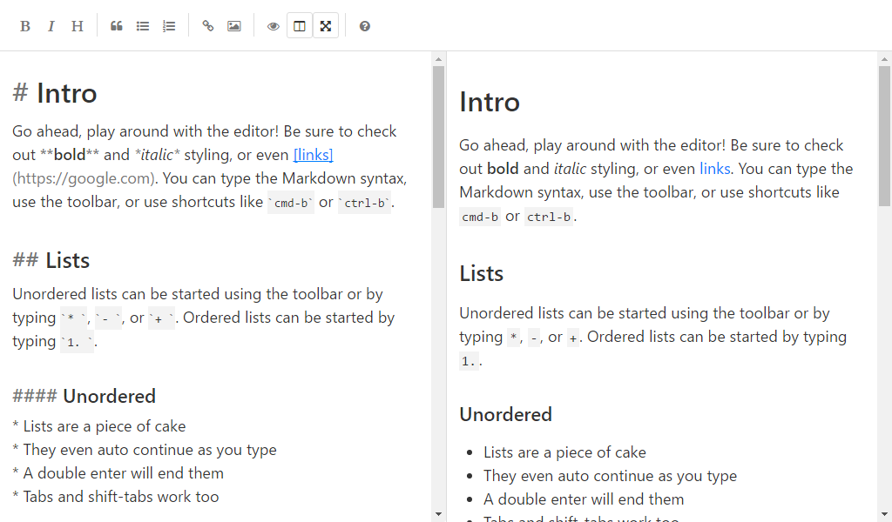

# SimpleMDE Theme Base

[](https://travis-ci.org/xcatliu/simplemde-theme-base) [](https://www.npmjs.org/package/simplemde-theme-base) [](https://greenkeeper.io/)

> The base theme for [SimpleMDE](https://simplemde.com/), you can easily [create your custom theme](https://github.com/xcatliu/simplemde-theme-base#create-your-theme) based on this.

- [Demo](http://simplemde-theme-base.mazimd.com/)
- [List of themes](https://github.com/xcatliu/simplemde-theme-base/wiki/List-of-themes)

## Screenshot



## How to use

First, follow [SimpleMDE official guide](https://github.com/NextStepWebs/simplemde-markdown-editor#install) to initial your editor.

Second, replace
```
https://cdn.jsdelivr.net/simplemde/latest/simplemde.min.css
```
with
```
https://cdn.rawgit.com/xcatliu/simplemde-theme-base/master/dist/simplemde-theme-base.min.css
```

That all, there is no step three.

## Create your theme

1. Folk [SimpleMDE Theme Base](https://github.com/xcatliu/simplemde-theme-base)
2. Clone the folked repo to your workspace
3. Run `npm install` and `npm start`
4. Open `docs/index.html` to see the demo
5. Update `src/_custom.scss` to customize your theme
6. Replace `base` to your theme name
7. Add your theme to the [list of themes](https://github.com/xcatliu/simplemde-theme-base/wiki/List-of-themes)

Checkout an example of customized theme: [SimpleMDE Theme Dark](https://github.com/xcatliu/simplemde-theme-dark)

### Colors

The most common way of customizing a theme is to change the colors.

SimpleMDE Theme Base make this super easy by abstract the colors of SimpleMDE:

```scss
//
//
// An example for dark theme
//
// Also you can copy variables from _variables.scss to _custom.scss
// to customize typography, spacing and other variables.
//
//


// Background color
$color-background: #444;
// For code, th
$color-background-over: rgba(255, 255, 255, 0.05);
// For selected area
$color-background-selected: rgba(255, 255, 255, 0.1);

// Border color
$color-border: #555;

// Text color
$color-text: #aaa;
$color-text-muted: #777;
// The link color
$color-text-link: hsl(50, 100%, 50%);

// For preview section
$smde-color-background-preview: #444;
// Image alt, HTML tag and attribute
$smde-color-text-tag: hsl(80, 50%, 50%);
```

Also you can copy variables from `_variables.scss` to `_custom.scss` to customize typography, spacing and other variables.

## License

MIT

## Thanks

Thanks to [SimpleMDE](https://github.com/NextStepWebs/simplemde-markdown-editor) for the great editor and [Mobi.css](https://github.com/NextStepWebs/simplemde-markdown-editor) for the inspiration of styling.

